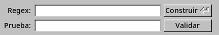
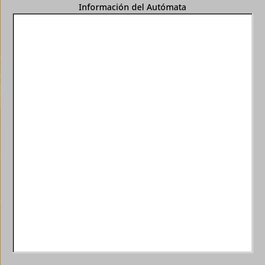

# Manual de Usuario

El programa es muy simple, tiene un menú con unas pocas opciones, entre ellas cerrar el programa y para saber más acerca de esta, 
2 campos de textos para entrar datos 
y un cuadro para poder ver la información del autómata finito. 

Acá podemos ver las dos cajas de texto principales, la primera,
la que tiene la etiqueta de "Regex" es donde va la Expresión regular, 
cuando presionas Enter o el botón "Construir" 
El programa crea un Automata Finito Deterministico en base a esta.    

La segunda Caja de texto es donde irá el texto con el que puedes verificar si la expresión regular está bien o no, solo se verifica una vez se presiona el botón "Validar".    

En la Caja de texto que se puede ver en la arriba de arria es donde se muestra toda la información del Autómata, 
los símbolos que utiliza, los estados, los estados de aceptación y la tabla de transisiones.

Con esto ya puedes Utilizar libremente el programa
